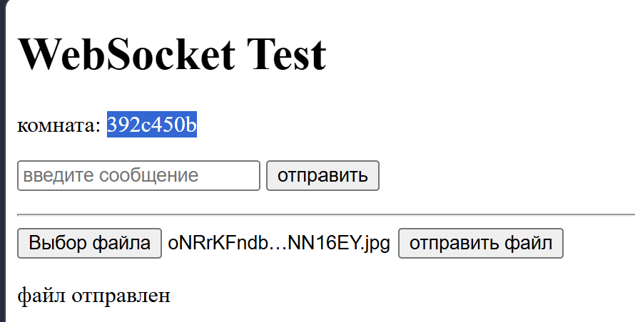
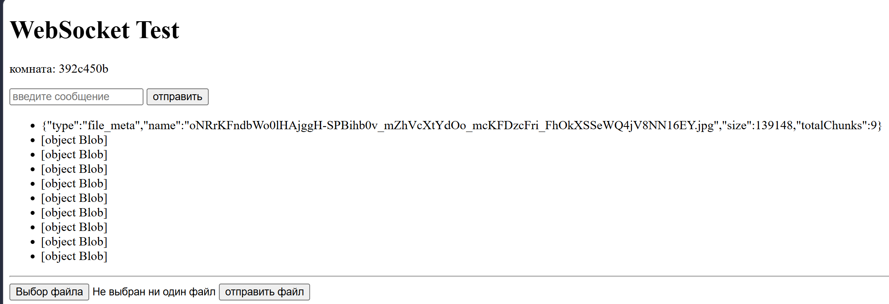

# P2P File Drop

Сервис для прямой передачи файлов между устройствами — без облачного хранилища. Файлы не сохраняются на сервере: он выступает лишь "почтальоном", который перекидывает данные от отправителя к получателю в реальном времени через WebSocket.

Пет-проект, который я пишу вручную (без AI-кодогенерации) в первую очередь ради того, чтобы разобраться в сетях, протоколах передачи данных и (на следующих этапах) end-to-end шифровании.

## Как это работает

1. Отправитель создаёт комнату — сервер генерирует короткий уникальный код
2. Получатель вводит этот код и присоединяется к той же комнате
3. Отправитель выбирает файл — он режется на чанки по 16 KB
4. Чанки летят через WebSocket на сервер, а сервер тут же пересылает их получателю (файл нигде не сохраняется на диске сервера — только транзитом проходит через память)
5. Получатель собирает чанки обратно в файл и получает ссылку на скачивание

```
Отправитель  →  WebSocket  →  FastAPI relay-сервер  →  WebSocket  →  Получатель
   (chunk 1, chunk 2, ... chunk N — файл никогда не сохраняется на сервере целиком)
```

## Стек

- **Backend:** Python, FastAPI, WebSocket (без сторонних библиотек вроде Socket.IO — работаем с чистым WebSocket API, чтобы понимать протокол на уровне деталей)
- **Frontend:** чистый HTML/JS, без фреймворков — тоже осознанное решение, чтобы полностью понимать, что происходит на каждом шаге

## Статус проекта

- [x] Базовый WebSocket-relay между двумя клиентами
- [x] Комнаты (room_id) — изолированные каналы для пары отправитель/получатель
- [x] Генерация кода комнаты на сервере (`POST /create_room`)
- [x] UI создания / присоединения к комнате
- [x] Разбиение файла на чанки и потоковая отправка через WebSocket
- [x] Сборка файла на стороне получателя + скачивание
- [ ] End-to-end шифрование (ECDH + AES-GCM через Web Crypto API)
- [ ] QR-код для быстрого подключения вместо ручного ввода кода
- [ ] Деплой relay-сервера (VPS/Oracle Cloud Free Tier)
- [ ] Красивый финальный UI (сейчас используется технический `test.html` для отладки бэкенда)
- [ ] Индикация разрыва соединения и обработка обрывов передачи

## Почему без облака и без сторонних SDK

Идея проекта — не просто "сделать file-sharing сервис" (таких готовых полно), а разобраться руками в вещах, которые обычно скрыты за библиотеками:

- Как устроен WebSocket-протокол на уровне текстовых/бинарных фреймов
- Как правильно резать и потоково передавать большие файлы, не забивая память сервера
- Как работает обмен ключами (ECDH) и симметричное шифрование (AES-GCM) без "магии" готовых крипто-SDK
- Как проектировать простой прикладной протокол поверх WebSocket (сообщения `file_meta`, бинарные чанки и т.д.)

## Скриншоты

*(добавить по мере готовности UI)*






## Запуск локально

```bash
git clone https://github.com/SanMartin1337/P2P-file-drop.git
cd P2P-file-drop

python3 -m venv .venv
source .venv/bin/activate   # Windows: .venv\Scripts\activate

pip install fastapi uvicorn websockets

uvicorn main:app --reload
```

Сервер поднимется на `http://127.0.0.1:8000`. Открой `test.html` в браузере (в двух вкладках, чтобы проверить обмен между отправителем и получателем).

## Структура проекта

```
├── main.py        # FastAPI backend: HTTP-эндпоинт создания комнаты + WebSocket relay
├── app.js          # Логика фронтенда: комнаты, WebSocket, нарезка/сборка файла
├── test.html       # Технический UI для отладки (заменится на финальный дизайн)
└── README.md
```

## Дальнейшие планы

Ближайший приоритет — end-to-end шифрование: обмен ключами через ECDH прямо в браузере (Web Crypto API), вывод общего секрета через HKDF и шифрование каждого чанка через AES-GCM с уникальным nonce. Сервер при этом продолжит быть "слепым" пересыльщиком — видит только зашифрованные байты.

После этого — QR-код для подключения (вместо ручного ввода кода комнаты) и полноценный деплой relay-сервера, чтобы передача работала не только в пределах одной локальной сети, а откуда угодно.